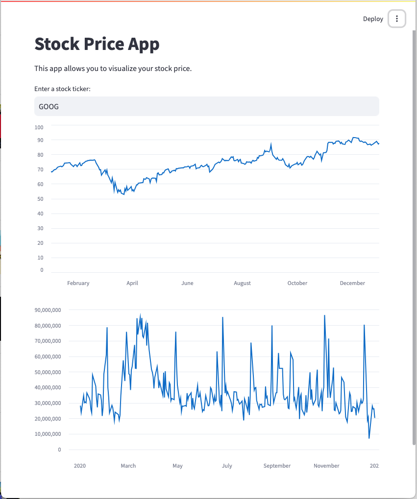
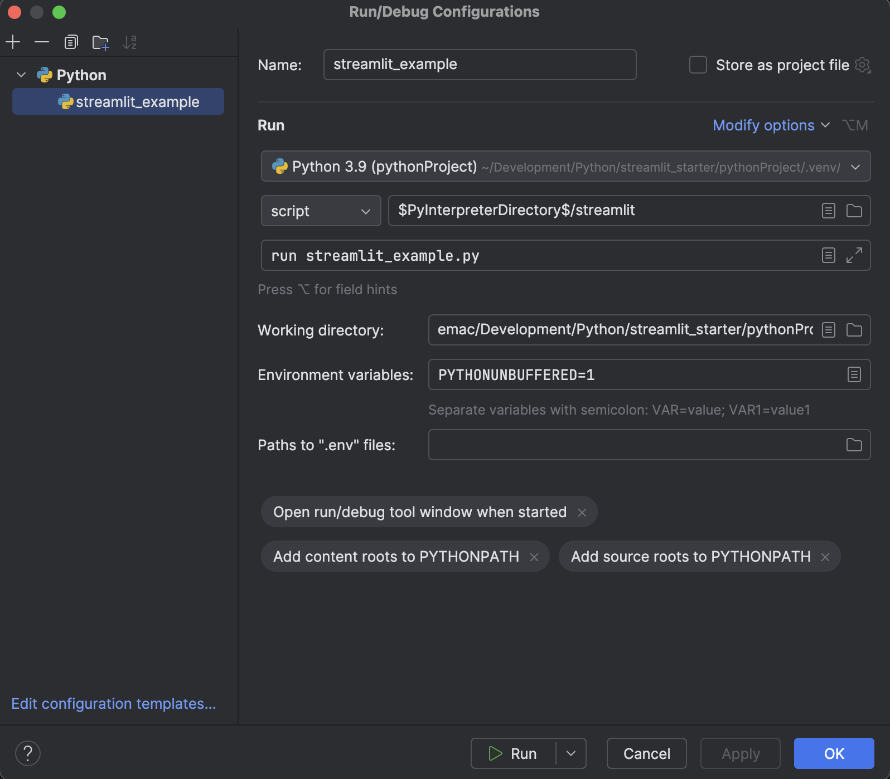

# Streamlit Starter App
## Simple StockPrice App built with Streamlit in Pycharm

This application gets data from the Yahoo Finance project (https://pypi.org/project/yfinance/)

> data = yf.download(ticker, start='2020-01-01', end='2021-01-01')

Then uses Streamlit to plot the Close and Volume subsets onto line charts:

> st.line_chart(data['Close'])
> 
> st.line_chart(data['Volume'])

## to run with terminal:

`pip install streamlit`

`streamlit run streamlit_example.py`

## to run with Pycharm run/debug config:

### Configure Python Interpreter:

> Add New Interpreter > Add Local Interpreter > [Dialog] OK

> Install Packages

### Create Run/Debug config:

(https://discuss.streamlit.io/t/version-1-5-0/21455/11)

